On performance
============================

Commercial databases like to do publicity stunts by publishing
“performance comparisons” of competing databases, with the results
invariably favouring their products. We are not going to do that
because, first, we do not want to attract the wrong kind of attention;
second and more importantly, such benchmarks don’t educate users beyond
the “trust us, we are the best” preaching. Instead, we want our
benchmarks to help the users answer the following questions:

-  For my particular workload, what are the pros and cons of the
   different setups that I can choose from?
-  What is the performance I can expect from such a setup and is it
   enough for me?

The setup
---------

We will only be comparing Cozo to itself running on two different
machines:

-  Mac Mini (2020)
-  Linux Server (2017)

The Mac Mini runs MacOS 13.0.1, has Apple M1 CPUs with 4 performance
cores and 4 efficiency cores, 16GB of memory and a pretty fast NVMe SSD
storage. Its benchmarks would be typical of recent reasonably powerful
desktop and laptop machines. The Linux server runs Ubuntu 22.04.1 LTS,
has two Intel Xeon E5-2678v3 CPUs with a total of 24 physical cores,
64GB of memory and one of the slowest SSD storage I have ever seen. You
can expect similar performance if you (over)pay cloud providers. If you
have servers that have newer hardware, you can probably expect much
better performance.

We will be running Cozo `embedded in
Rust <https://github.com/cozodb/cozo/blob/dev/cozo-core/benches/pokec.rs>`__
(in fact, we will take advantage of Rust’s built-in benchmark tools). As
it is embedded, we will use different numbers of concurrent threads to
run Cozo to see how a particular task scales with the number of
processors. Embedding Cozo in Rust is the fastest way to run Cozo and if
your use case involves embedding in another language such as Python,
there will be overheads due to Python itself. Still, if for similar
tasks as recorded here you experience orders of magnitude worse
performance, please let us know since it could be an environment-related
bug.

It seems graph databases like to use the `Slovenian social network
Pokec <https://snap.stanford.edu/data/soc-pokec.html>`__ for benchmarks
(see
`here <https://github.com/memgraph/memgraph/tree/master/tests/mgbench#books-datasets>`__
and
`here <https://www.arangodb.com/2018/02/nosql-performance-benchmark-2018-mongodb-postgresql-orientdb-neo4j-arangodb/>`__).
We will use three different sizes for subsets of the data:

-  “Tiny”: 10,000 vertices, 121,716 edges
-  “Small”: 100,000 vertices, 1,768,515 edges
-  “Medium”: 1,632,803 vertices, 30,622,564 edges, this is the full
   dataset

Note that this is the same subsets as done
`here <https://github.com/memgraph/memgraph/tree/master/tests/mgbench#pokec>`__,
except their “small” is our “tiny”, their “medium” is our “small”, and
their “large” is our “medium”. We feel it to be rather presumptuous in
this age to call a dataset with just over 30 million edges “large”. When
will we do a benchmark for a truly `webscale
dataset <https://www.tigergraph.com/benchmark/>`__? When we have more
time and a deeper pocket, maybe! Anyway, the “medium” size is probably
large enough for most purposes.

The schema for the data is the following, written in CozoScript:

::

   {:create user {uid: Int => cmpl_pct: Int, gender: String?, age: Int?}}
   {:create friends {fr: Int, to: Int}}
   {:create friends.rev {to: Int, fr: Int}}

If you don’t read CozoScript yet: the relation ``user`` has an integer
primary key and three non-keys representing the vertices, the relation
``friends`` has a composite ``(Int, Int)`` primary key representing the
edges, and the relation ``friends.rev`` acts as an index for the edges
in the reverse direction (in Cozo, everything is very explicit).

We will be comparing Cozo running with three different storage engines
as introduced in the first section:

-  In-memory engine
-  SQLite engine
-  RocksDB engine

All queries are run with snapshot isolations in effect: when mixing
reads and writes, reads will only see a snapshot of data valid at the
start of the transaction, and when writes conflict with each other, at
least one of them will fail to commit, in which case we will manually
retry the query. This is the only consistency level Cozo currently
supports: there is no way to opt for a more lax consistency model.

All mutations sent to the backend engine complete only when the
underlying storage engine transactions complete: there is no “fire and
forget” involved to give the user a false impression of high
performance.

Finally, note that we only benchmark the out-of-box experience of Cozo.
In the case of the RocksDB engine, there are lots of knobs you can turn
to make it much more performant for certain workloads (the easiest knob
is to beg it to use more memory, which helps when dealing with large
datasets), but we expect most users *not* to be experts in such
optimizations.

You can download the complete result of the benchmarks as a spreadsheet
`here <https://github.com/cozodb/cozo-docs/raw/main/resources/cozo_perf.xlsx>`__
to do your own analysis.

Loading data
------------

Batch import
~~~~~~~~~~~~

The first question we are interested in is how long it takes to load our
datasets into the database: do we need to wait for days? Our approach is
to parse data from a text file and insert them into the database in
batches of 300, single-threaded.

For the tiny dataset, the results are:

======== ======= ====================
Platform Backend Time taken (seconds)
======== ======= ====================
Mac Mini Mem     0.265788
Mac Mini RocksDB 0.686022
Mac Mini SQLite  6.383260
Server   Mem     0.494136
Server   RocksDB 1.285214
Server   SQLite  27.971535
======== ======= ====================

Here is for the small dataset:

======== ======= ====================
Platform Backend Time taken (seconds)
======== ======= ====================
Mac Mini Mem     5.429186
Mac Mini RocksDB 11.752198
Mac Mini SQLite  146.848621
Server   Mem     8.741262
Server   RocksDB 19.261249
Server   SQLite  432.705856
======== ======= ====================

And for the large dataset:

======== ======= ====================
Platform Backend Time taken (seconds)
======== ======= ====================
Mac Mini Mem     155.894422
Mac Mini RocksDB 212.731813
Server   Mem     219.956052
Server   RocksDB 348.638331
======== ======= ====================

As you can see we didn’t even test for SQLite’s performance using the
medium dataset, as we grew tired of waiting. If the trend continues,
import with SQLite backend would take at least 45 minutes on Mac Mini,
and more than 2 hours on the Linux server. SQLite’s performance looks
really bad here, but we used to import a similar amount of data into
another graph database and it took us *half a day*. And even if you
insist on using the SQLite backend, there is a much faster way to import
data: keep reading.

For the RocksDB backend, everything can be done within a few minutes,
which is more than reasonable for tens of millions of rows.

We can compare performance across the board by considering *raw rows per
second* in imports, in which an edge counts as two raw rows since it
must appear in two relations:

.. figure:: batch_import_rps.svg
   :alt: Batch import

   Batch import

Here RocksDB performs well, especially for scaling: the decrease in raw
rows per second due to larger datasets is very small. And it is always
within a factor of three for the mem backend which does not persist data
at all.

Some of you may say that this is not fair for the SQLite backend, since
with some additional tricks and more clever batching, you can get higher
numbers for SQLite. Well, we are testing for simple-minded out-of-box
performance, and the fact is that with
`tuning <https://github.com/cozodb/cozo#tuning-the-rocksdb-backend-for-cozo>`__,
the RocksDB performance can be increased even more drastically.

How much memory does the database use during the import process? We will
show the peak memory usage as reported by the system:

.. figure:: batch_import_mem.svg
   :alt: Batch import mem

   Batch import mem

The benchmark infrastructure takes about 50MB of memory even if it does
nothing. So the SQLite backend always uses a negligible amount of extra
memory. RocksDB on the other hand will use memory to speed things up. As
we have said before we didn’t collect data for importing the medium
dataset into the SQLite backend.

The data for the mem backend is shown below separately:

.. figure:: batch_import_mem_mem.svg
   :alt: Batch import mem for mem

   Batch import mem for mem

This measures the size of the whole dataset as the mem backend can only
store data in memory. As we can see Apple’s OS somehow uses memory more
efficiently. For almost everything we do in this benchmark, the memory
usage of the mem backend is very similar to this, so we will not show
the memory usage of the mem backend before. If you are interested
nonetheless, you can look at the raw data in the
`spreadsheet <https://github.com/cozodb/cozo-docs/raw/main/resources/cozo_perf.xlsx>`__.

Backup
~~~~~~

In Cozo we can backup the database to an SQLite-based database. How fast
is the backup?

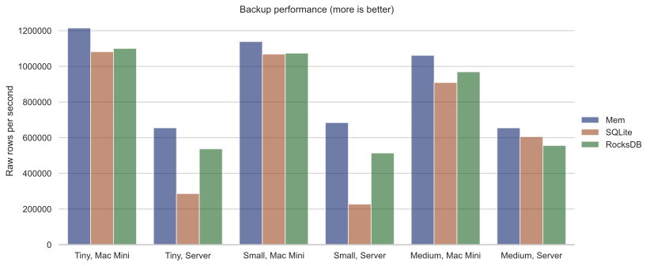

   Backup

On a Mac Mini, this is around one million raw rows per second for all
backends, which should be fast enough for most purposes. On the Linux
server, the bad quality of the SSD shows, but it is still quite fast. By
the way, if you have lots of data and you want to use the SQLite
backend, you can batch import the data into the RocksDB or mem backend,
and then back up the database. The backup file *is* a working
SQLite-backed database, and the whole process is *a lot* faster than
importing into an SQLite-backed database directly.

Memory usage:

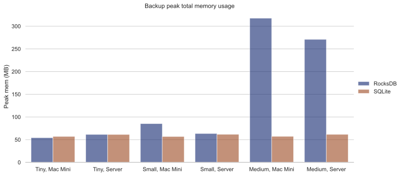

   Backup memory

Not much surprise here. As we said before around 50MB is used by the
benchmark infrastructure, so take that into account.

Restoring from backup
~~~~~~~~~~~~~~~~~~~~~

How fast is restoring from a backup?

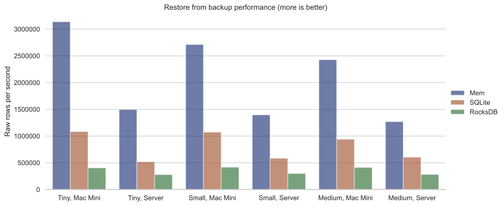

   Restore

This is the only benchmark where RocksDB performs the worst, with 400K
raw rows per second. Restoring into the SQLite backend is fast, but in
fact, you can be faster still: just copy the backup file over (or use it
directly if you don’t intend to write any data)!

Memory usage:

.. figure:: restore_mem.svg
   :alt: Restore memory

   Restore memory

No surprise.

Transactional queries (OLTP)
----------------------------

Online Transaction Processing (OLTP) queries are simple reads or writes
queries that are expected to finish quickly, and you are expected to
deal with lots of them.

Point read
~~~~~~~~~~

This is the simplest kind of query you can imagine: given an ID, it just
reads the corresponding row and gives it to you:

::

   ?[cmpl_pct, gender, age] := *user{uid: $id, cmpl_pct, gender, age}

The performance metric we are interested in is the queries per second
(QPS):

.. figure:: single_vertex_read_qps.svg
   :alt: Single vertex read QPS

   Single vertex read QPS

The effect of data size on such queries is small, and in general, adding
more cores helps almost *linearly*, though in the case of Mac Mini, only
the performance cores help, the efficient cores are pretty useless and
can get in the way. In general, you can expect at least around 100K QPS
regardless of data size on all setups when you fully utilize your
resources.

For memory usage:

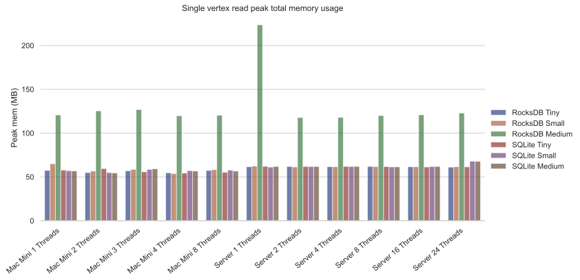

   Single vertex read mem

RocksDB only starts using memory with the medium dataset. In all other
cases, memory usage is minimal.

Point write
~~~~~~~~~~~

This is the simplest write query: it just creates a new vertex:

::

   ?[uid, cmpl_pct, gender, age] <- [[$id, 0, null, null]] :put user {uid => cmpl_pct, gender, age}

For this query, we are only going to show multi-thread performances for
RocksDB, since writing to the other backends are protected by a big
lock, so they are effectively still single-threaded:

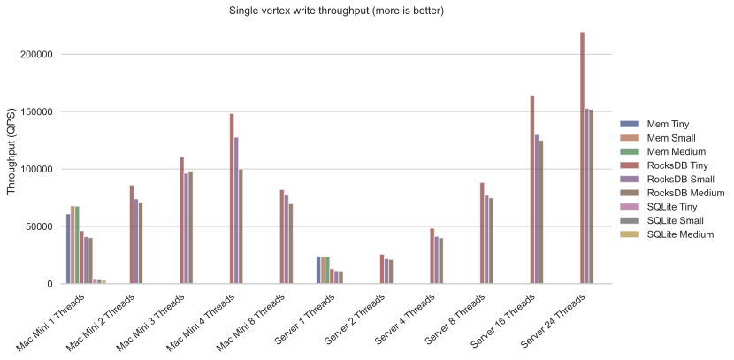

   Single vertex write QPS

RocksDB shines here as you can expect more than about 100K QPS for both
setups. Using more than the number of performance cores on the Mac Mini
decreases performance quite a bit, so avoid that if you can. But you
can’t see the SQLite bars, can you? Let’s use logarithmic scale instead:

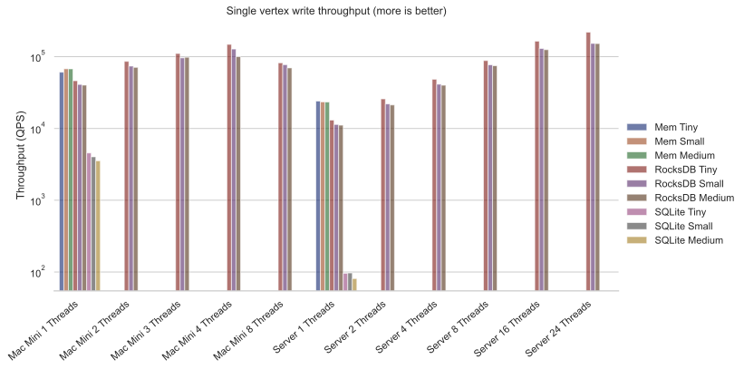

   Single vertex write QPS zoom

Whereas RocksDB easily manages more than 100K QPS, SQLite struggles to
reach even 100 QPS on the server with the slow SSD. That is more than
1000 times slower! It is so slow since each request translates into an
SQLite write transaction, and SQLite writes transactions are known to be
super expensive. These separate transactions are unavoidable here
because that’s the rule for the game: lots of independent, potentially
conflicting writes to the database. The moral of the story is to stay
away from the SQLite backend if you expect lots of independent writes.

Memory usage?

.. figure:: single_vertex_write_mem.svg
   :alt: Single vertex write mem

   Single vertex write mem

Completely reasonable, I’d say. Even for large datasets, RocksDB keeps
memory usage under 500MB.

For writing to edges, we need to put the data into both the ``friends``
relation and the reverse ``friends.rev`` relation:

Point update
~~~~~~~~~~~~

This query updates a field for a given row:

::

   ?[uid, cmpl_pct, age, gender] := uid = $id, *user{uid, age, gender}, cmpl_pct = $n
   :put user {uid => cmpl_pct, age, gender}

The performance:

.. figure:: single_vertex_update_qps.svg
   :alt: Single vertex update QPS

   Single vertex update QPS

It is slower than point writes, but within a factor of two. You can
still easily manage more than 50K QPS for RocksDB. Memory usage is
almost the same as the point write case:

.. figure:: single_vertex_update_mem.svg
   :alt: Single vertex update mem

   Single vertex update mem

Mixed queries?
~~~~~~~~~~~~~~

Of course in realistic situations, you would expect read, write and
update to occur concurrently. We won’t show the details here, but the
conclusion is that in such cases, the RocksDB backend doesn’t care if
the queries are reads, writes or updates, whereas any amount of writes
kills SQLite. If you want the details, you can find them in the
`spreadsheet <https://github.com/cozodb/cozo-docs/raw/main/resources/cozo_perf.xlsx>`__.

If SQLite performs so badly at writes, why include it at all? Well, its
performance is still acceptable if you are using it to build a desktop
or mobile application where writes are batched, and with the SQLite
engine, the database does not use more than the absolute minimal amount
of memory.

Analytical queries (OLAP)
-------------------------

Online analytical processing (OLAP) queries are queries which may touch
lots of rows in the database, do complex processing on them, and may
return a large number of rows. All graph queries should fall into this
category.

For OLAP queries, we are more interested in latency: how long does a
query take before it returns (on average)?

Friends of friends
~~~~~~~~~~~~~~~~~~

The classical graph traversal query is the “friends of friends” query:
finding out who the friends of friends of a particular person are. For
such queries, the intermediate results and the return sets must be
stored somewhere (usually in memory). For these queries, we will only
show results for the “medium” dataset: 1.6 million vertices and 32
million edges. The same query for the smaller datasets complete much
faster: refer to the raw numbers if you are interested.

We start by following the “friends” relation twice—a “2 hops” query:

::

   ?[to] := *friends{fr: $id, to: a}, *friends{fr: a, to}

On average, this will return hundreds of rows.

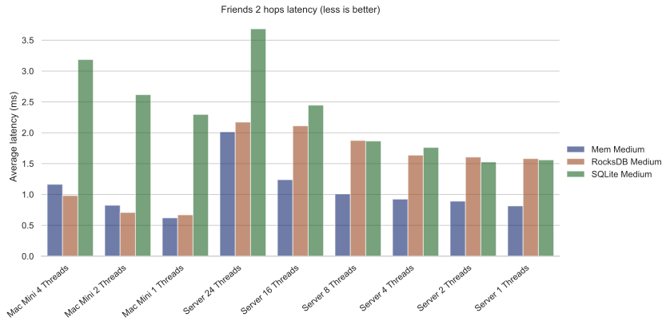

   Friends 2 latency

We see that the RocksDB backend performs very well, and if the storage
is fast enough, it is even faster than the mem backend. The SQLite
backend also performs quite well competitively. Having more threads
harms latency, but not much.

For memory usage: |Friends 2 mem|

As usual, the SQLite backend doesn’t use more than the absolute minimal
amount of memory, unless you have many concurrent threads. The memory
usage of the RocksDB backend is also pretty small.

Let’s now go up one hop to find out friends’ friends’ friends:

::

   l1[to] := *friends{fr: $id, to}
   l2[to] := l1[fr], *friends{fr, to}
   ?[to] := l2[fr], *friends{fr, to}

The variance of the number of returned rows is now very high: on average
thousands of rows will be returned, and if you start with some
particular nodes, you get tens of thousands of rows. The latency is as
follows:

.. figure:: friends_3.svg
   :alt: Friends 3 latency

   Friends 3 latency

The trend is similar to the 2 hops case, except that the latency is
about twenty times as long, roughly proportional to the number of
returned rows.

For memory usage:

.. figure:: friends_3_mem.svg
   :alt: Friends 3 mem

   Friends 3 mem

Because the database must keep the *return set* in memory, in all cases
the memory usage increases. But it still manages with under 1GB of
memory, even with 24 concurrent threads running on the server.

Now let’s go to the extreme, by considering the 4 hops query:

::

   l1[to] := *friends{fr: $id, to}
   l2[to] := l1[fr], *friends{fr, to}
   l3[to] := l2[fr], *friends{fr, to}
   ?[to] := l3[fr], *friends{fr, to}

The number of return rows now varies wildly: from tens of thousands of
rows if you start with someone who is solitary, or more than half of the
whole dataset (more than 600K rows) if you start with someone popular!

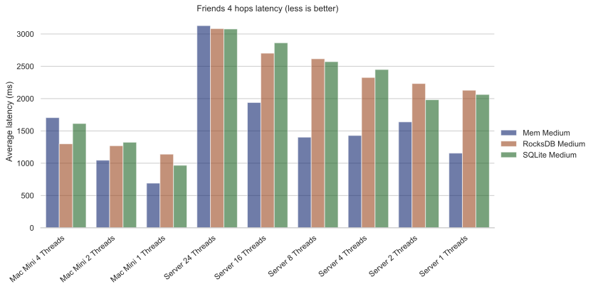

   Friends 4 latency

I’d say that for return sets this big, the average latency of a few
seconds (or even less than a second) is excellent.

Peak memory usage just reflects the size of the returned sets:

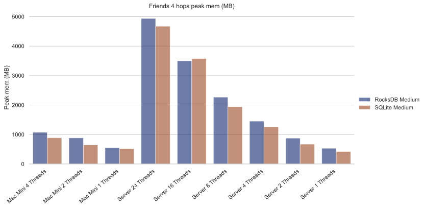

   Friends 4 mem

We won’t go beyond four hops but will note instead that if you go up to
six hops, by the “six degrees of separation”, you will return the
majority of nodes in almost all cases. Actually, in our experiments,
this already happens with a high probability for five hops.

Aggregations
~~~~~~~~~~~~

Aggregations present a different challenge to the database: here the
amount of data to keep in memory is not much (in the case of counting,
just a single counter), but the database must scan every row of a
relation to return the result. For these queries, we will again only
show results for the “medium” dataset: 1.6 million rows for the relation
in question.

First, we will group users by their age and return the counts for each
age group:

::

   ?[age, count(uid)] := *user{uid, age}

.. figure:: aggr_grp.svg
   :alt: Aggregation group latency

   Aggregation group latency

This tests the single-core CPU performance and disk read performance.
Around 1 second (within a factor of two) to scan the whole table in all
cases.

The memory usage is minimal as the return set is small:

.. figure:: aggr_grp_mem.svg
   :alt: Aggregation group mem

   Aggregation group mem

Now let’s add a filter to the aggregation:

::

   ?[age, count(age)] := *user{age}, age ~ 0 >= 18

This adds in a bit of processing time, but in terms of the order of
magnitude the numbers are similar to before: |Aggregation filter
latency|

The memory usage is almost identical:

.. figure:: aggr_filter_mem.svg
   :alt: Aggregation filter mem

   Aggregation filter mem

The results are similar if we compute several aggregations in tandem:

::

   ?[min(uid), max(uid), mean(uid)] := *user{uid, age}

The latency: |Aggregation stats latency|

and the memory usage: |Aggregation stats mem|

Pagerank
~~~~~~~~

Finally let’s see how one of our canned algorithms performs: the
Pagerank algorithm with query

::

   ?[] <~ PageRank(*friends[])

This time we will show results for different dataset sizes. First for
the tiny dataset (10K vertices, 122K edges):

.. figure:: pagerank_tiny.svg
   :alt: Pagerank tiny latency

   Pagerank tiny latency

Completes in the blink of an eye. Memory usage:

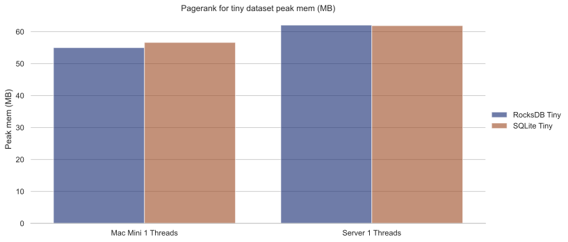

   Pagerank tiny mem

Not much, since the dataset is truly tiny.

Now for the small dataset (100K vertices, 1.7M edges):

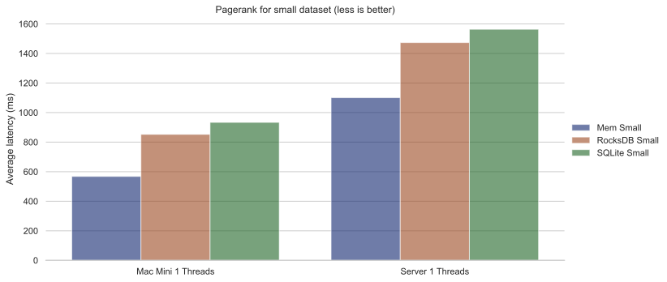

   Pagerank small latency

About one second within a factor of two. Memory usage:

.. figure:: pagerank_small_mem.svg
   :alt: Pagerank small mem

   Pagerank small mem

This is the amount of memory used to store the graph in the main memory,
which is less than the size of the total graph on disk.

Now for the full dataset (1.6M vertices, 32M edges):

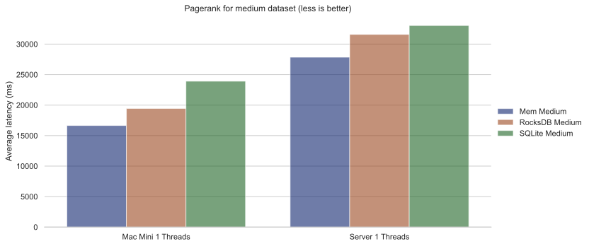

   Pagerank medium latency

About half a minute across all setups. I’d argue that this is as fast as
*any* implementation could go. (, currently, we did not implement the
Pagerank algorithm ourselves: instead, we used the excellent
implementation of this crate. In the future we will continue to improve
canned algorithms according to the metrics that we collected from our
internal tests.) Memory usage:

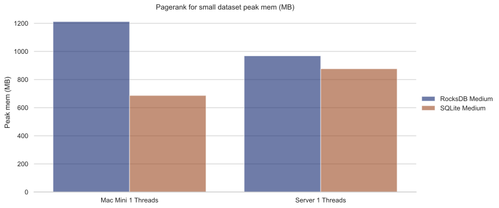

   Pagerank medium mem

1GB memory for such a workload is more than reasonable.

Conclusion
----------

We hope that you are convinced that Cozo is an extremely performant
database that excels on minimal resources. As it can run (almost)
everywhere, please try it for your use case, and send us feedback so
that we can improve Cozo further! In a future blog, we will talk about
some of the design decisions of Cozo, and the impact on performance and
memory usage of these decisions.

.. |Friends 2 mem| image:: friends_2_mem.svg
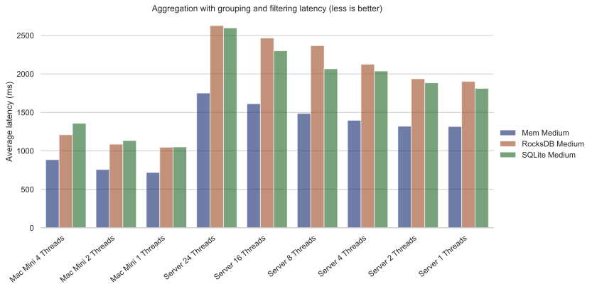
.. |Aggregation stats latency| image:: aggr_stats.svg
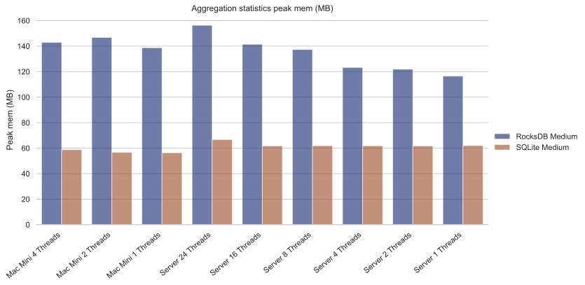
