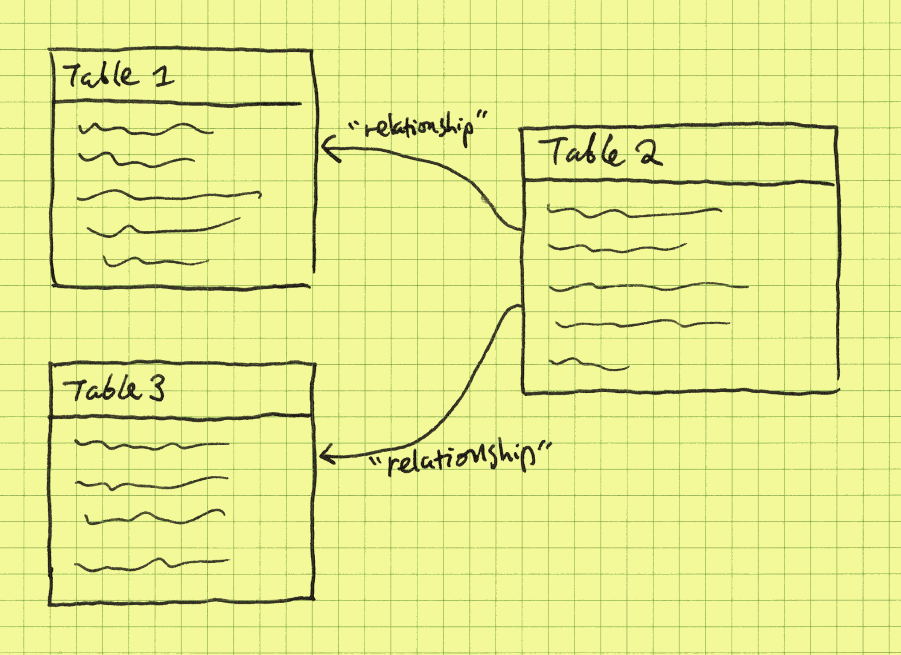
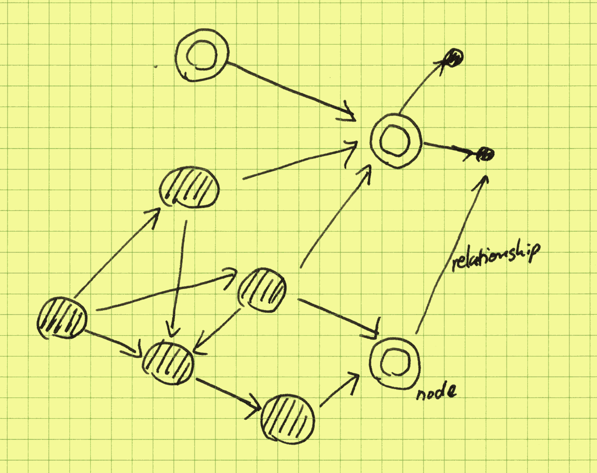
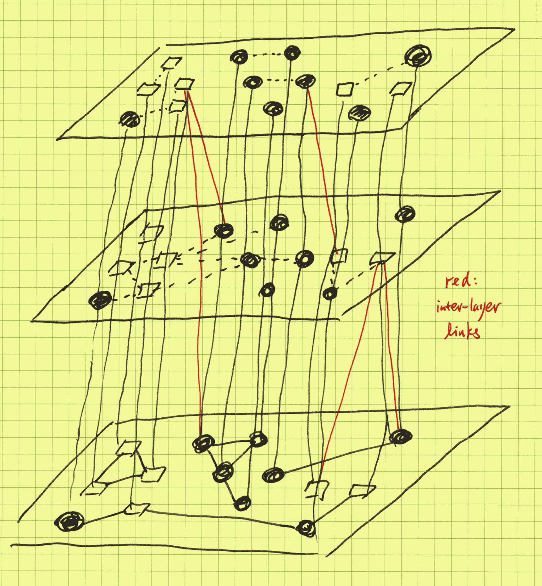
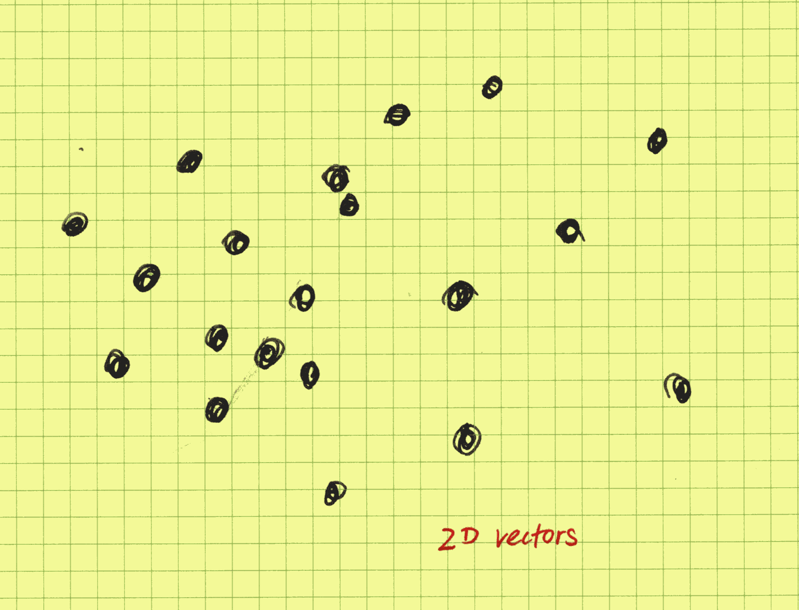
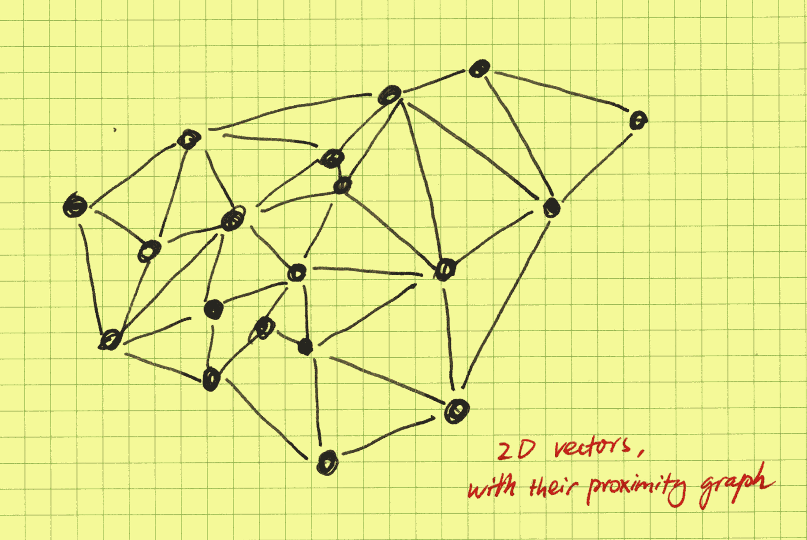
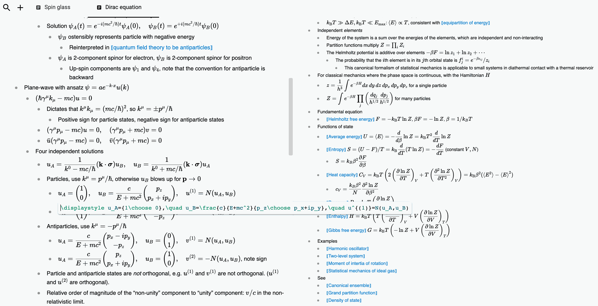

# Experience CozoDB: The Hybrid Relational-Graph-Vector Database - The Hippocampus for LLMs

After a long repose, today we are very excited to bring you the release of CozoDB v0.6!

## Introduction

The singular feature addition in this release is the introduction of _vector search within Datalog_.

> For those who are unfamiliar with the concept: vector search refers to searching through large collections of usually high-dimensional numeric vectors, with the vectors representing data points in a metric space. Vector search algorithms find vectors that are closest to a given query vector, based on some distance metric. This is useful for tasks like recommendation systems, duplicate detection, and clustering similar data points, and has recently become an extremely hot topic since large language models (LLMs) such as **ChatGPT** can make use of it to partially overcome their inability to make use of long context.

### Highlights

* You can now create HNSW (hierarchical navigable small world) indices on relations containing vectors.
* You can create multiple HNSW indices for the _same_ relation by specifying filters dictating which rows should be indexed, or which vector(s) should be indexed for each row if the row contains multiple vectors.
* The vector search functionality is integrated _within Datalog_, meaning that you can use vectors (either explicitly given or coming from another relation) as pivots to perform _unification_ into the indexed relations (roughly equivalent to table joins in SQL).
* Unification with vector search is semantically no different from regular unification, meaning that you can even use vector search in _recursive Datalog_, enabling extremely complex query logic.
* The HNSW index is no more than a hierarchy of proximity graphs. As an open, competent graph database, CozoDB exposes these graphs to the end user to be used as regular graphs in your query, so that all the usual techniques for dealing with them can now be applied, especially: community detection and other classical whole-graph algorithms.
* As with all mutations in CozoDB, the index is protected from corruption in the face of concurrent writes by using Multi-Version Concurrency Control (MVCC), and you can use multi-statement transactions for complex workflows.
* The index resides on disk as a regular relation (unless you use the purely in-memory storage option, of course). During querying, close to the absolute minimum amount of memory is used, and memory is freed as soon as the processing is done (thanks to Rust's RAII), so it can run on memory-constrained systems.
* The HNSW functionality is available for CozoDB on all platforms: in the server as a standalone service, in your Python, NodeJS, or Clojure programs om embedded or client mode, on your phone in embedded mode, even in [the browser with the WASM backend](https://www.cozodb.org/wasm-demo/).
* HNSW vector search in CozoDB is performant: we have optimized the index to the point where basic vector operations themselves have become a limiting factor (along with `memcpy`), and we are constantly finding ways to improve our new implementation of the HNSW algorithm further.

For a more detailed description, see {doc}`here <../vector>`.

> For those who have not heard of CozoDB before: CozoDB is a general-purpose, transactional, relational database that uses Datalog for query, is embeddable but can also handle huge amounts of data and concurrency, and focuses on graph data and algorithms. It even supports time travel (timestamped assertions and retractions of facts that can be used for point-in-time query)! Follow the {doc}`Tutorial <../tutorial>` if you want to learn CozoDB.

### Comparisons to other systems

* **PostgreSQL with pgVector**: I am a fan of the PostgreSQL project and always look up to it as a role model. The problem is that the pgVector extension suffers from low recall and is not general enough for many use cases; both these problems don't exist in CozoDB's HNSW index. And SQL itself is just not cut out for complex graph queries, which is the focus of CozoDB.
* **hnswlib and faiss**: Unlike many vector databases currently available, our HNSW index is not a wrapper around one of these two libraries but a new implementation written from scratch in Rust. This is necessary since we want the index to be disk-based and support MVCC. These two options are mostly single-purpose libraries, whereas CozoDB is a general-purpose database system.
* **commercial vector databases running in the Cloud**: CozoDB is FOSS (MPL 2.0 license) and can run in embedded mode (standalone server mode is available if you need it). In terms of functionalities, these cloud databases support only simple queries, whereas in CozoDB they can be as complex as you like (if you really want it, there is an imperative mini-language to write the CozoDB queries). On the other hand, if your requirements are simple, these systems are probably easier to get started with.

The remainder of this note comprises two parts. The first part will, by using a running example, show how the need for vector search arises in a particular application, and as a result of this new feature, how existing systems can become much more powerful. The second part will include some of my personal, somewhat crazy musings and speculations for further development of AI with reference to CozoDB.

## The emergence of vector search in CozoDB

> This is not meant for a comprehensive introduction. We will not stop to explain the syntax: see the {doc}`Tutorial <../tutorial>` instead.

### From relational thinking to graph thinking

First, we will show how CozoDB can deal with traditional relational and graph data.

Let's start with a humble sales dataset. CozoDB is first and foremost a relational database, as the following schema for creating the dataset relations show. First, the customers:

```
:create customer {id => name, address}
```

Here `id` is the key for the relation. In a real dataset, there will be many more fields, but here we will just have the names and addresses for simplicity. Also, we did not specify any type constraints for the fields, again for simplicity reasons. Next, the products:

```
:create product {id => name, description, price}
```

Finally, the sales data itself:

```
:create purchase {id => customer_id, product_id, quantity, datetime}
```

The mental picture we should have for these relations is:



Let's assume that these relations have already been filled with data. Now we can start our "business analytics". First, the most popular products:

```
?[name, sum(quantity)] := *purchase{product_id, quantity}, 
                          *product{id: product_id, name}

:order -sum(quantity)
:limit 10
```
Here, the Datalog query joins the `purchase `and `product` relations through their ID, and then the quantities purchased are sum-aggregated, grouped by product names. Datalog queries are easier to read than the equivalent SQL, once you get used to it.

Then the shopaholics:

```
?[name, sum(amount)] := 
        *purchase{customer_id: c_id, product_id: p_id, quantity}, 
        *customer{id: c_id, name},
        *product{id: p_id, price},
        amount = price * quantity

:order -sum(amount)
:limit 10
```

These "insights" are bread-and-butter relational thinking, useful but quite shallow. In graph thinking, instead of mentally picturing customers and products as rows in tables, we picture them as dots on a canvas, with purchases as links between them. In CozoDB, graph modeling is done implicitly: the `purchase` relation already acts as the edges. The mental picture is now:



Graphs are all about how things are connected to each other, and among themselves. Here, products are connected to other products, mediated by purchases. We can materialize this mediated graph:

```
?[prod_1, prod_2, count_unique(customer_id)] := 
        *purchase{customer_id, product_id: prod_1},
        *purchase{customer_id, product_id: prod_2}

:create co_purchase {prod_1, prod_2 => weight: count_unique(customer_id)}
```

Here, the edge weights of the `co_purchase` graph are the number of distinct customers that have bought both of the products. We also directly saved the result in a new stored relation, for easier manipulation later (creating relations in Cozo is very cheap).

With this graph at hand, the famous diaper-beer correlation from the big-data era is then simple to see: if you start with a diaper product, the product connected to it with the largest weight is the most correlated product to it according to the data at hand. Maybe even more interesting (and difficult to do in a traditional relational database) is the _centrality_ of products; here, we can simply use the [PageRank](https://en.wikipedia.org/wiki/PageRank) algorithm:

```
?[product, pagerank] <~ PageRank(*co_purchase[])

:order -pagerank
:limit 10
```

If you run a supermarket, it may be beneficial to put the most central product in the most prominent display, as this is likely to drive the most sales of other products (as suggested by the data, but whether this really works must be tested).

### Augmenting graphs with knowledge and ontologies

You can try to derive more graphs from the sales dataset and experiment with different graph algorithms running on them, for example, using community detection to find groups of customers with a common theme. But there is a limit to what can be achieved. For example, the product "iPhone" and the product "Samsung phone" are not related in the dataset, though all of us can immediately see that they are both under the umbrella concept of smartphones. This latent relationship cannot be determined using e.g. correlation; in fact, sales of the two products are likely anti-correlated. But one would expect iPhone 15 and iPhone 11 to be correlated.

So, to derive more insights from the dataset, we need to augment it with knowledge graphs or ontologies (the distinction between the two need not concern us here). In concrete terms, someone would have already compiled a relation for us, for example:

```
:create relation{subject, verb, object}
```

With this, the iPhone--Android relationship may be discovered:

```
?[verb, concept] := 
        *relation{subject: "iPhone", verb, object},
        *relation{subject: "Samsung phone", verb, object}
```

The result should show that `verb` is matched to `"is_a"` and `concept` is matched to `"smartphone"`. Replacing `"Samsung phone"` by `"iPad"` should result in the binding `verb: "made_by"` and `concept: "Apple"`.

The mental picture is now:



Instead of a single-layer flat graph, we now have a layered graph, with the upper layers provided by the externally-provided knowledge graphs. In the picture we have drawn many layers, as the real power of this approach shows when we have many knowledge graphs from diverse sources, and insights may be derived by comparing and contrasting. The values of multiple knowledge graphs multiply when they are brought together instead of simple addition. In our running sales example, now using graph queries and algorithms, you can investigate competitors, complementary products, industry trends, sales patterns across different smartphone brands, customer segment-specific popularity, gaps and opportunities in the product catalogue, for example, which are all out of reach without the multi-layered approach.

### LLMs provide implicit knowledge graphs

Okay, so knowledge graphs are cool, but why are they not more widely used? In fact, they are widely used, but only inside big corporations such as Google (rumors have it that Google runs the world's largest knowledge graphs, which are at play whenever you search). The reason is that knowledge graphs are expensive to make and difficult to maintain and keep up to date, and combining different knowledge graphs, while powerful, requires a tedious translation process. You may already have expected this from our example above: even if we can hire a thousand graduate students to code the knowledge graph for us, who decided to code the verb as `"is_a"` instead of `"is a"`? What about capitalization? Disambiguation? It is a difficult and brittle process. In fact, all we care about are the relationships, but the formalities hold us back.

Fortunately for us non-Googlers, the rise and rise of LLMs such as GPTs have paved a new way. With the newest version of CozoDB, all you need to do is to provide embeddings for the product description. Embeddings are just vectors in a metric space, and if two vectors are "near" each other according to the metric, then they are semantically related. Below we show some vectors in a 2-D space:



So now the product relation is:

```
:create product {
    id 
    => 
    name, 
    description, 
    price, 
    name_vec: <F32; 1536>, 
    description_vec: <F32; 1536>
}
```

To show our excitement, we have provided 1536-dimensional embeddings for both the name texts and description texts, and we also annotated the vector types to be specific. Next, we create a vector index:

```
::hnsw create product:semantic{
    fields: [name_vec, description_vec], 
    dim: 1536, 
    ef: 16, 
    m: 32
}
```

This is an HNSW (hierarchical navigable small world) vector index, and `ef` and `m` are parameters that control the quality-performance trade-off of the index. Now when inserting rows for the `product` table, we use an embedding model (such as `text-embedding-ada-002` provided by OpenAI) to compute embeddings for the texts and insert them together with the other fields. Now an iPhone and a Samsung phone are related even without a manually curated knowledge graph:

```
?[dist, name] := 
    *product{name: "iPhone", name_vec: v},
    ~product:semantic{name | query: v, bind_distance: dist, k: 10, ef: 50}

:order dist
:limit 10
```

This is a nearest-neighbor search in embedding space. The first result should be "iPhone" itself with a distance of zero, followed by the other smartphones according to their similarity with the iPhone.

What is the mental picture now? The HNSW algorithm is a pure-graph algorithm that builds a hierarchy of proximity graphs, with the base layer containing all the indexed nodes and the upper layers stochastically-selected nodes that comprise a [renormalized](https://en.wikipedia.org/wiki/Renormalization#Renormalization_in_statistical_physics), zoomed-out picture of the proximity graph. Below is an example of a proximity graph in a 2-D space:



In CozoDB, unlike in other databases, we expose the inner workings to the user whenever it makes sense. This is especially relevant in the case of HNSW indices. In the above example, since we already know that `"iPhone"` is in the index, we do not need to use vector search _at all_ and can walk the proximity index directly to get its _proximity neighbors_ (which are not the same as the nearest neighbors):

```
?[dist, name] := 
    *product:semantic{layer: 0, fr_name: "iPhone", to_name: name, dist}

:order dist
:limit 10
```

The power of this is that all the Datalog tricks and all the classical graph algorithms can be applied to the graph, and we are just walking the graph; there are no vector operations at all! As an illustration, we can try to find the "transitive closure" of the iPhone with clipped distance (using a community detection algorithm works much better, but here we want to show recursion):

```
iphone_related[name] := 
    *product:semantic{layer: 0, fr_name: "iPhone", to_name: name, dist}, 
    dist < 100
iphone_related[name] := 
    iphone_related[fr_name], 
    *product:semantic{layer: 0, fr_name, to_name: name, dist}, 
    dist < 100
?[name] := iphone_related[name]
```

Now you will have all the iPhone-related products by walking only the (approximate) proximity graph with edges of distance smaller than 100.

Semantically, the HNSW search operation is no different from normal stored relation queries, so you can use them in recursions as well:

```
iphone_related[name] := 
    *product{name: "iPhone", name_vec: v}, 
    ~product:semantic{name | query: v, bind_distance: dist, k: 5, ef: 50}
iphone_related[name] := 
    iphone_related[other_name], 
    *product{name: other_name, name_vec: v}, 
    ~product:semantic{name | query: v, bind_distance: dist, k: 5, ef: 50}
?[name] := iphone_related[name]
```

But this version will be slower than walking the index directly since now lots of vector operations are involved. It is most useful when we want to "jump" from one index to another: their proximity graphs are not connected, so you use vectors from each of them to make the connection.

This is rather cute, but how is it going to replace knowledge graphs? The proximity graph we have built is _generic_, making no distinction between an `"is_a"` relation and a `"made_by"` relation, for example.

There are many ways to solve this problem, which can be roughly divided into two classes.

In the first class, we use LLMs together with the proximity graph to build the knowledge graph automatically. For example, a properly-prompted LLM can look at `"iPhone"` and its neighbors and generate concepts and verbs as candidates for insertion into a knowledge graph, represented as a relation in CozoDB. The tags and verbs are then de-duped by using HNSW search in the embedding-enriched knowledge graph to prevent a situation where both `"iPhone"` and `"iphone"` are present, for example (it is recommended to let LLMs verify that its proposal is valid for important work). If you want to go down this route, better results are obtained if you already have an idea of what the verbs are in order to constrain the content generated by the LLMs.

The second class is even easier to implement: we just have to come up with a series of questions that we want to answer by consulting a knowledge graph, for example, "what is the manufacturer of this product", "in a supermarket, how is this product catalogued", etc., and we let the LLMs generate answers to these questions, with the product description given as context, and finally, we store the _answers_ together with their embeddings in a dedicated HNSW index. Now the proximity graph for these answers constitutes the appropriate _section_ of the required knowledge graph. You may need to wrap your head around a little bit when using this approach, but in fact, it works even better than the first as it is much more adaptable.

We hope that you have seen that CozoDB's seamless mixture of relational, graph, and vector search capabilities offers unique advantages and opens up unexplored territories for exploring novel ideas and techniques in data management and analysis!

## Toward the hippocampus for AI

We have seen that CozoDB becomes much more powerful with its support for vector embeddings and implicit proximity graphs. In fact, this empowerment cuts both ways, and the possibilities are limitless. The following sections are highly speculative and maybe controversial, and I would be glad if they could lead to useful discussions.

### Knowledge management for AI

Many people use knowledge management tools such as Roam Research, Obsidian, and Notion, just to name a few. The key feature of these tools is the ability to create links between different pieces of text. I am extremely frustrated with the existing solutions because they do not support LaTeX well (I want them to display equations nicely, and I want painless authoring of LaTeX formulas and useful debugging information), so I wrote my own:



Naturally, CozoDB is at its heart. With the advent of LLMs and CozoDB's inclusion of vector search capabilities, and with enough tweaks to my private knowledge management system, I find that explicit linking becomes increasingly unnecessary, as the connections can be derived automatically by the LLMs.

Then I began to have an eerie feeling that it is not me who is reading these notes anymore; it is the AI. And in fact, properly structured, _the AI can utilize CozoDB better than me_.

In the paper [_Generative Agents: Interactive Simulacra of Human Behavior_](https://arxiv.org/abs/2304.03442), it is shown that an essential ingredient for generative agents is the ability to keep notes and to make effective use of them for chain-of-thought reasoning. In the paper, a linear array of memory cells is used, and we all know that our brain is not really like that. A proximity graph for memory storage, as implemented in CozoDB, seems a much better fit for a memory for AI.

In fact, even letting the LLM agent do random walks on the proximity graph can produce surprising (in a good sense) results, as this is really exploring a fuzzy associative memory, and the long-range links in the upper hierarchy can provide the occasional "leaps of imagination".

### The fractal von Neumann architecture

The current generation of LLMs runs on computers with the von Neumann architecture: a CPU that performs operations on data stored in memory, with data and instructions mixed in the same memory space.

Now if we consider individual LLMs themselves as CPUs (hence fractal), then their knowledge management tools such as CozoDB act as the memory. Here too, instructions (what the LLM must do, i.e., prompts) and data (contexts) are mixed together. CozoDB has many appealing properties to act as AI's memory: a practical but important consideration is that the CPU had better control the memory exclusively; using it "on the cloud" doesn't perform too well. In developing CozoDB, it was decided very early on that this database must _scale_, and scaling means not only scaling up but also scaling down. The original motivation is to provide knowledge graph support wherever needed. Now this ubiquity of CozoDB certainly paves the way for offline intelligent agents. {doc}`Soft-erasure features <../timetravel>` in the sense of customizable timestamped facts and assertions also help the agent better organize its own thoughts.

> Cutting-edge LLMs running on the phone are certainly possible _and near_. One of my favorite pastimes when new LLMs come out is to ask them to give pi to as many digits as they can (they may refuse, but with enough cajoling, they will eventually comply). The interesting thing is that they start giving wrong results after a few hundred digits (maybe even less), but not totally wrong: there are large segments of correct sequences, just out of order. So today's LLMs are just totally wasteful in how they use their internalized memory: they remember lots of useless details. With time, and when trained with their own von Neumann memory, they will become more efficient in using their parameters, and then they won't need to be so big.

Does this scale even further? Autonomous agents, each with their private memory, communicating in a public arena (CozoDB running in the Cloud, for example)? What will they do then?

### The interpretation of artificial dreams

To form a true community of agents, we need real individuals, not shallow carbon-copies of the same collective subconscious. Today's incarnation of GPTs is nothing more than a collective subconscious: different prompts will elicit different personalities and responses from them.

Private memory and individual fine-tuning of model weights according to private experience are of course required, but we need more than that. One hangover from the era of Big Data is the belief that all data must be preserved for later use. The reality is that we just get a bigger and bigger pile of rubbish that is harder and harder to make sense of. Humans don't do this. When awake, humans remember and reason, but when dreaming, humans distill, discard, and connect higher concepts together. Random-walking LLMs on proximity graphs can do this, and the constraints are no longer measured in gigabytes but instead in minutes (hours) and joules (calories). AI also needs to rest, reflect, and sleep, after all.

### Towards intelligence

In a sense, today's AI is never awake. Waking people can answer three questions: Who am I? Where do I come from? Where am I going to? Often left unsaid is that the answers to these three questions must be _examined_ (as in ["the unexamined life is not worth living"](https://en.wikipedia.org/wiki/The_unexamined_life_is_not_worth_living)), and must not be recitations from a rulebook. This calls for a much deeper integration of the subconscious processing and memory.

So what is "examined"? Rote memorization certainly is not. A popular critique of LLMs as intelligent agents is that all they can do is continue the text, and what they can achieve can be, in principle, no more than what is already contained in the learned texts. This may be true if LLMs are trained with only supervised/unsupervised learning, but a crucial step in the production of systems such as ChatGPT is the final RLHF step. With reinforcement learning and enough experience, there is no reason to set any bounds on intelligence as dictated by the training material; otherwise, how did AlphaGo and friends beat humans? The later versions even have ZERO prior contexts for learning.

Intelligence must precede the ability to examine. I do think current best systems display signs of intelligence, but they are extremely weak. One manifestation is that they are totally shallow thinkers, and this is more fundamental than the fact that the transformer architecture makes internally making plans difficult (making plans can be done inside the memory, i.e., the database, which is what humans do as well). The reason, I believe, is that the RLHF procedure currently applied is rather primitive. Being primitive has benefits: as we know, intelligent lifeforms need to reside on the edge of chaos and order; any highly developed systems will need to be intricate and must be evolved, not made. And when in unfavorable environments, they can quickly spiral to death. But evolution they will need. Now they have the hippocampus installed, the next roadblock is updating weights on the phone. We will see how we can get there.

Let's end this note with the following ancient maxim:

> ΓΝΩΘΙ ΣΕΑΥΤΟΝ.